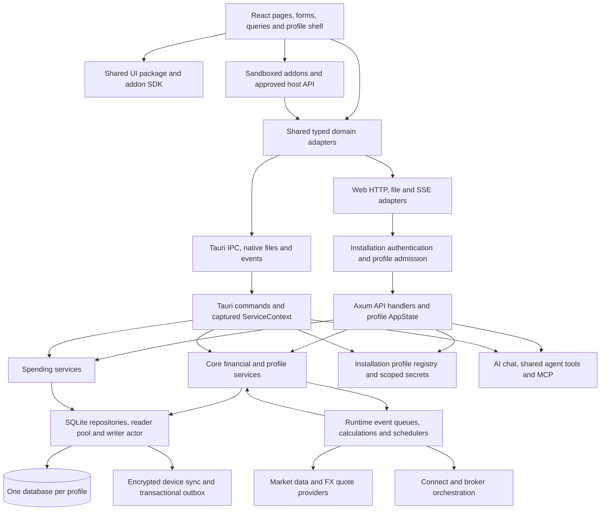

# Architecture and upstream maintenance audit

Audit date: **2026-09-30**. Issue: [#2](https://github.com/felipebaez/wealthfolio/issues/2), parent
[#1](https://github.com/felipebaez/wealthfolio/issues/1). Source:
`6ee11b1278eff8b5123280e740fa6983b501952b`; branch: `audit/2-architecture`. Accepted planning
target: **more than 50 clients on one private server or VM**; hardware, concurrency, portfolio sizes
and recovery objectives remain unspecified. Investigative work only. Proposed implementation remains
pending human selection and consolidated review.

**Evidence labels:** **Confirmed** means inspected source, metadata, or an explicitly identified
executed check; it does not mean the behavior was exercised. **Inferred** means a consequence or
recommendation derived from that evidence. **Unknown** means unverified runtime, contractual,
capacity, or bank behavior. Evidence references below are commit-pinned repository links. Runtime
limitations and reproduction recipes are in
[architecture-validation.md](architecture-validation.md).

## Executive recommendation

**Inferred:** Wealthfolio is a useful starting point for the financial tracking component of an
advisory service. Retain its React frontend, shared Rust calculations, SQLite repositories, import
preview, and database-per-profile infrastructure. This audit does not establish a reason to rewrite
the product or move financial data to a shared tenant database. The missing first requirement is
durable client authorization, not a different calculation engine. [E01] [E02] [E03]

**Inferred:** Prefer a two-client synthetic isolation trial using separate application instances,
data directories, vaults and master keys. This is a safety trial, **not production readiness for
more than 50 clients**. For the required single-VM launch, compare an automated fleet of separate
instances (option A) with one application using explicit profile ownership/authorization (option B).
A minimizes product patches but requires fleet provisioning, upgrades, monitoring and recovery
automation; B reduces process/fleet overhead but needs substantial security implementation and
negative tests before client access. Keep A as the first safety-validation candidate; select the
launch topology only after workload/cost gates and security/operations review. Both share a VM
operator and host failure domain; advisors require separately authorized access. Do not admit
multiple clients to an unmodified shared installation. [E03] [E04] [E05] [E50]

**Inferred:** Start with client-uploaded files and existing import review. Do not make Connect,
remote AI, MCP, or arbitrary add-ons prerequisites. These optional features add distinct
financial-data and credential flows; self-hosting the web server does not self-host their remote
services. The bank and commercial-readiness lanes must resolve real export coverage and commercial
provider rights. No Czech bank compatibility is established here. [E09] [E17] [E18] [E19] [E20]

**Inferred:** Before showing advisory-grade values, reproduce and resolve the live FX fallback that
substitutes 1 for a missing rate. Also verify interrupted imports and recalculation recovery with
synthetic data. Successful activity persistence does not certify that current holdings/performance
have finished rebuilding or that import-run provenance was saved. [E10] [E11] [E12]

**Architecture impact of this audit:** documentation and source-only investigation. No
network/provider settings, foreground/background execution, persistence/events, business-logic
ownership, failure propagation/retries, or user-edit precedence changed. The proposals below
identify future boundary changes; none is authorized implementation.

## What the application does and who it serves

**Confirmed:** The repository describes a portfolio tracker. Its implemented surfaces include
investment and cash accounts, transaction activities, holdings snapshots, lots/cost basis, market
pricing, FX, allocation and rebalancing, performance and income, net worth and alternative assets,
spending/budgets, goals and retirement planning, CSV/JSON export, and database backups. It runs as a
native Tauri application and as a browser frontend backed by an Axum server. [E01] [E02] [E06] [E49]
[E07]

**Inferred:** The current product fits individuals managing their own finances, including people
with several portfolios/accounts and installation-local profiles. A financial account is a ledger, a
portfolio is a selection of accounts, a profile is a database/runtime selection, an installation
session is browser admission, and a Connect identity associates optional cloud features. None of
those alone establishes the advisory business's client ownership or advisor mandate. [E03] [E04]
[E08]

**Unknown:** Suitability as a regulated advisory reporting system, Czech statement coverage,
numerical accuracy on client portfolios, contract rights for commercial hosting, and production
capacity. This is neither legal approval nor a financial-calculation certification.

## Architecture map

The following map is **confirmed from source**; arrows represent call/dependency direction, not
network guarantees. [E01] [E02] [E03] [E06] [E13] [E17] [E18] [E19] [E20]

### Components and responsibilities

| Component                                                      | Confirmed responsibility and reuse point                                                                                                                                                                                              | Evidence                |
| -------------------------------------------------------------- | ------------------------------------------------------------------------------------------------------------------------------------------------------------------------------------------------------------------------------------- | ----------------------- |
| `apps/frontend/src/`                                           | React pages, React Router routes, hooks/query caches, profile shell, forms and localized UI. Call typed adapters; do not put a second accounting engine in the frontend.                                                              | [E06] [E09]             |
| `packages/ui/`                                                 | Shared React UI components, formatting and theme-compatible presentation. Frontend Vite resolves package source; declarations are built for standalone checks. Package version is 3.9.0, independently of app 3.9.2.                  | [E01] [E21] [E48]       |
| `packages/addon-sdk/`, `packages/addon-dev-tools/`             | Typed host API, manifests/permissions, development/scaffolding. SDK version 3.9.0; compatibility must follow SDK/runtime checks rather than assume app-version identity.                                                              | [E21] [E20]             |
| `adapters/shared/`                                             | Domain calls invoke symbolic commands through `#platform`. `@/adapters` and `#platform` switch in Vite at build time using `BUILD_TARGET`.                                                                                            | [E01] [E06]             |
| `adapters/web/`, `adapters/tauri/`                             | Web command-to-REST mapping, multipart CSV upload, SSE, browser downloads; native IPC scope capture, file dialogs and event listeners. Platform-specific behavior remains necessary.                                                  | [E06] [E09] [E22]       |
| `apps/server/src/api/`                                         | HTTP extraction/DTOs, route admission and response/status adaptation around injected profile services. Some job sequencing and DTO mapping live here; it is not exclusively trivial forwarding.                                       | [E02] [E03] [E07] [E12] |
| `apps/tauri/src/commands/`, `context/`, `profiles.rs`          | Registered native commands, profile/runtime capture, native lifecycle and shared-service access. Native has an active runtime, while web caches multiple profile runtimes.                                                            | [E13] [E14]             |
| `crates/core/`                                                 | Financial activity validation, asset identity/enrichment, accounts/portfolios, snapshots, valuation/performance, FX, planning, health checks, exports, profile registry and secret interface. Repository traits separate persistence. | [E02] [E08] [E10] [E15] |
| `crates/storage-sqlite/`                                       | Diesel repositories/schema/migrations, SQLCipher-aware database access, serialized writes, snapshot/portable maintenance, imports, sync state/outbox, AI history and agent records.                                                   | [E11] [E16] [E59] [E23] |
| `crates/market-data/`, `crates/http/`                          | Provider traits/capabilities, instrument resolution, rate limits/circuit breakers and HTTP construction. Extend the provider system instead of adding direct requests to handlers.                                                    | [E17] [E24]             |
| `crates/connect/`, `crates/device-sync/`                       | Shared broker ingestion/orchestration/token lifecycle; pairing/enrollment, encrypted snapshots/events, push/pull/replay and retry policy. These are separate from SQLite derived-data recalculation.                                  | [E18] [E25]             |
| `crates/ai/`, `crates/agent-tools/`, `crates/wealthfolio-mcp/` | AI provider catalog/chat loop, shared financial tools with draft/commit/read scopes, MCP transport/auth context and audit interface. Hosts supply the current profile's environment.                                                  | [E19] [E26]             |
| `crates/spending/`                                             | Cash activities, categorization, events, budgets and analytics using storage repositories and account opt-in; activity changes can schedule categorization.                                                                           | [E02] [E12]             |

**Confirmed:** TypeScript defaults to the Tauri aliases; `pnpm type-check` alone is not equal
verification of the two runtime configurations. The adapter parity test checks reachable symbolic
commands, Tauri registration and shared exports, and includes transport assertions. It does not
replace handler authorization or response-semantic tests. [E01] [E27]

### Storage, identities, secrets and derived data

**Confirmed:** `profiles.json` and its backup hold installation-local profile metadata, not
financial rows. The registry holds an installation ownership lock, validates metadata, tracks
pending deletion, and namespaces secrets. The legacy default profile may retain an existing database
path/root; new profiles use `profiles/<UUID>/app.db`. Do not assume every profile database is in the
new directory layout. [E03] [E04]

**Confirmed:** Each financial runtime builds repositories/services against one database. Financial
tables have account/asset IDs rather than a profile/tenant column. Principal tables include
accounts, activities, assets, quotes/FX data, holdings snapshots and positions, lots/disposals,
daily account valuations, portfolios/account membership, taxonomies, goals, import templates/runs,
spending, AI threads/messages, MCP tokens/audit and sync state/outbox. Activities, manually
entered/imported holdings, and quotes are inputs; calculated keyframes, lots, daily valuations and
performance outputs are derived or depend on those inputs. A manual snapshot is an input and must
not be treated as disposable calculated state. [E08] [E16] [E23] [E51]

**Confirmed:** Storage uses WAL, foreign keys, busy timeouts, a reader pool capped at eight
connections per database, and a writer actor. Repository `exec_tx` writes and projected sync-outbox
changes share the writer transaction. The outbox wakes device sync after committed writes; it is not
a durable queue for arbitrary domain recalculation events. Database ownership guards
maintenance/reopen and startup. [E11] [E16] [E59]

**Confirmed:** SQLCipher is compiled in; a file can still be plaintext. Web encryption is optional
policy configured through `WF_DB_REQUIRE_ENCRYPTION`; the server derives database/vault keys from
its installation master key, with per-profile database derivation for nonlegacy profiles. Existing
files are probed rather than automatically converted. Tauri uses OS-backed secret storage; the web
server builds a file-backed encrypted vault. Profile namespaces are not separate trusted
infrastructure operators. [E03] [E04] [E28]

**Inferred:** In self-hosted web mode, the infrastructure operator controls the executable, files
and installation key and can access financial data. Device-sync encryption against a relay does not
prevent the self-hosted runtime/operator from reading the plaintext it processes. [E25] [E54] [E28]
[E55] [E56]

## Representative execution paths

### 1. Login and profile admission

**Confirmed, web:** Frontend authentication checks server status/login. Server password login
validates the configured installation password hash. OIDC performs discovery, state/token checks and
allowlist admission, then issues the same installation session cookie; local JWT claims use
`sub = wealthfolio-web` plus a random session ID, not the verified IdP issuer/subject. Profile POST
commands obtain the browser owner from that session, list/create/select/unlock profiles, and issue
an in-memory scope grant. Financial requests carry `x-wf-profile-scope`; SSE uses `profileScope` in
the query. Admission resolves that owner/scope to a fixed profile `AppState`, then rechecks the
grant after the handler and during response streaming. An unscoped financial request has a
compatibility path only for one unlocked profile. [E03] [E05] [E50] [E22] [E29]

**Confirmed, native:** Profile commands go to Tauri directly; ordinary typed calls include the
installed immutable scope. Native profiles associate the main-window owner with a
runtime/generation. Portfolio commands capture a `ServiceContext` before execution, so queued work
does not acquire a subsequently selected profile. Local revocation discards late frontend responses.
[E13] [E14] [E22]

**Inferred:** Extend the existing admission choke point with durable client ownership and role
policy if a shared deployment is selected. Retaining verified issuer/subject in the application
principal would be an intentional authorization/persistence change. Preserve scope freshness, stream
revocation and fixed runtime binding; frontend hiding cannot substitute for this change. This
overlaps the identity/isolation lane and must be deduplicated there. [E03] [E05] [E50]

### 2. Portfolio read

**Confirmed:** A frontend holdings query calls shared `getHoldings(filter)`. Web maps `get_holdings`
to `POST /api/v1/holdings/query`; profile admission injects `AppState`; holdings handlers resolve an
`AccountScope` via `PortfolioService`, filter eligible accounts, and call `HoldingsService`. Tauri's
registered `commands::portfolio::get_holdings` resolves the same service through captured context.
`AccountScope` means all/account/accounts/portfolio inside the admitted database, not a business
authorization role. [E06] [E49] [E07] [E08] [E13]

**Confirmed:** `HoldingsService` obtains latest snapshots, assets/classifications, cash and lot
data; live valuation uses locally stored latest quote pairs and `FxService`. This read path is not
itself a fresh-market-provider request. Background/manual sync supplies those local quotes.
Therefore displayed prices may be stale or incomplete even when the read succeeds. Do not add a new
network dependency to portfolio reads while introducing client authorization. [E10] [E15] [E17]

### 3. Activity creation and file import

**Confirmed, manual entry:** Frontend form → shared activity adapter → web `POST /activities` or
Tauri `create_activity` → core `ActivityService`. The service normalizes/validates
economic/account/asset inputs and duplicate keys, awaits repository persistence, then emits
activity-change domain events. The handler clears health cache and returns the created activity;
recalculation/enrichment proceeds separately. [E09] [E11] [E30]

**Confirmed, CSV:** Upload → parse configuration → web multipart `/activities/import/parse` or Tauri
byte parsing → shared Rust `parse_csv` → frontend mapping/template/date/amount conversion and asset
review → `preview_import_assets` / `check_activities_import` → user confirmation →
`import_activities`. The core service reloads accounts, resolves currencies/assets, normalizes
again, enforces write invariants, checks idempotency/duplicates, inserts accepted activities in a
repository transaction and returns ordered row outcomes plus a summary. Preview can perform
configured-provider asset lookups; the parser itself is local. Parsed raw CSV is handled in memory
by the examined HTTP endpoint. AI attachment storage is a separate path. [E09] [E11] [E30] [E31]

**Confirmed:** File-import-run creation and final summary update are separate repository operations;
errors are warned and activities can still persist without the run link. Valid rows can be imported
while invalid/policy-failed or duplicate rows are skipped; explicit force-import paths can clear
duplicate keys. Repeat-import protections therefore need to be validated with the actual mapping and
user-selected policy. Import success is neither all-file acceptance nor complete provenance. [E30]

**Inferred:** Czech adapters should first be templates/mapping presets feeding this pipeline. Only
verified format gaps justify extending the shared parser/domain model. A new direct database
importer would bypass preview, account checks, idempotency, events and device-sync projection.
Investment files and payment-account files need different mappings; no bank schema is inferred from
synthetic examples. [E09] [E30] [E31] [E57] [E58]

### 4. Holdings and performance calculation

**Confirmed:** Domain-event planning combines account/asset IDs and earliest affected dates. The
worker reconciles quote-sync state, optionally synchronizes configured market data, then
recalculates holdings snapshots and daily valuations with the requested full/since-date policy. Core
`SnapshotService` compiles activities into economic events/holdings, incorporates paired-transfer
source lots, and uses a recalculation gate. Transaction-tracked accounts derive positions from
activities; holdings-tracked accounts use supplied snapshots. Manual snapshot dates and sources
remain significant. [E12] [E15] [E32]

**Confirmed:** `PerformanceService` reads valuations and activity/lot economics, calculates scoped
return/flow measures including TWR and IRR, and reports data-quality warnings/unavailable cases.
Money calculations use `Decimal` extensively, but the IRR numerical solver converts cash flows to
`f64`; blanket claims that every calculation is exact decimal arithmetic would be incorrect.
Internal-transfer boundaries depend on the selected account scope. Missing prices, external-flow
provenance and holdings-only history affect which measures are applicable. [E33]

**Confirmed:** Web update/recalculate endpoints enqueue a portfolio job and return HTTP 202. Their
defaults include incremental/backfill market synchronization. Consequently even an explicitly
requested history rebuild can request external prices; a local-only rebuild requires a tested
existing policy/path, not an assumption based on the button's name. Price-history-change event
planning has tests asserting no extra market fetch for that event alone. [E12] [E32]

**Inferred:** Advisory reports need a recorded as-of date, missing/stale data indication, transfer
treatment and completion state. Do not certify values based only on an import toast, 202 response,
or nonempty holdings result. Preserve existing data-quality fields rather than manufacture zeros or
a second calculation engine. [E10] [E12] [E33]

### 5. Background synchronization and events

**Confirmed:** Core mutations publish runtime-specific `DomainEventSink` events. Web uses an
unbounded in-memory channel and a 500 ms debounce worker; native has its own sink/planner/worker.
Portfolio and market results fan out through the web per-runtime `EventBus` to SSE or native events,
and frontend listeners invalidate queries. Lagged SSE subscribers are dropped rather than replayed.
Events are notifications, not an authoritative record of financial state. [E12] [E14] [E22] [E34]

**Confirmed, web timers:** Opening a profile builds and caches its runtime and starts workers.
Startup also opens profiles with saved Connect refresh tokens. Broker sync waits 60 seconds, then
runs every four hours if a refresh token and eligible subscription are available. Quote sync starts
after 120 seconds and runs every six hours. Browser profile locking does not shut down the cached
server runtime/workers. Device sync has a five-minute cadence plus write wakes/debounce/backoff and
transactional outbox replay. [E03] [E18] [E25] [E35]

**Confirmed, broker path:** Runtime command/timer → token lifecycle/plan checks and Connect API
client → shared `SyncOrchestrator` → connection/accounts discovery, eligible tracking-mode
selection, paginated activities and holdings phases → core ingestion/storage → progress/domain
events. Accounts in `NOT_SET` tracking mode are skipped. Storage has broker-user-patch projection
and `is_user_modified` handling; these policies should be extended, not bypassed, by new connectors.
[E18] [E36]

**Inferred:** Per-client sync suspension needs backend policy checked by workers, not simply logout
or UI lock. Durable recalculation recovery is not proven: startup backfill detects accounts with
missing valuation rows, but does not establish that an existing account's historical edit was
incorporated after a process died between commit and event processing. Reproduce this gap before
adding persisted markers or retry workers; the current device outbox does not cover it. [E11] [E12]
[E35] [E60]

### 6. Export, backup and restore

**Confirmed, logical exports:** Both runtimes use shared export formatting. Web
`/utilities/export/{data_type}/{format}` reads admitted-profile accounts, activities, holdings,
goals or portfolio history and builds a CSV/JSON response; Tauri uses native save handling. These
are data exports, not a full installation recovery package. Accounts export selects nonarchived
accounts, while activities export searches all activities; derived holdings/history are scoped
through the default account selection. Do not promise identical coverage across export types. [E37]
[E38]

**Confirmed, backup:** The web backup endpoint makes a database snapshot using keyed `DbAccess` and
ownership; saved snapshots retain that database's encryption. Portable export is a separate
conversion, password-protected `.wfbackup` or an explicit plaintext `.db`, with a
profile/unlock-session-bound download job. Core storage maintains scratch files, verification,
snapshot leases and pre-operation backups. The database upgrade path creates a verified
pre-migration snapshot for existing files before running pending migrations; backup failure blocks
the migration batch. [E23] [E28] [E39]

**Confirmed, restore difference:** Native supports preview/confirm/maintenance/reopen. The examined
web API has no online database upload/restore route. Server restore is an offline command, with
server stopped, profile selection, readable destination/key/policy checks, validation and explicit
replacement confirmation. It replaces a profile database, rather than merging records. Device-sync
bookkeeping is reset and Connect must reconnect; provider settings and PAT records from the backup
are retained. [E23] [E28] [E39] [E40]

**Inferred:** Installation recovery must include a consistent registry, all selected database files,
credential vault, installation key and profile mapping. A database portable export excludes external
secrets and cannot reconstruct a lost installation registry. Older backups can restore old PAT
revocation state; an operator/client offboarding workflow must account for this. Cross-profile and
post-revocation restore guarantees remain untested here and belong in security/operations
acceptance. [E28] [E39] [E40]

## External dependencies and outbound financial-data flows

**Confirmed source inventory unless marked otherwise.** This is a map of implemented paths, not a
packet capture or exhaustive egress certification. Enabling a feature is a separate business
decision. Secrets remain accessed through `SecretStore`; do not put them in browser storage or audit
fixtures. [E17] [E18] [E19] [E20] [E28]

| Path                                 | Destination and data crossing the boundary                                                                                                                                                                                                                                                                | Trigger, paid dependency and limitation                                                                                                                                                                                                                                                            |
| ------------------------------------ | --------------------------------------------------------------------------------------------------------------------------------------------------------------------------------------------------------------------------------------------------------------------------------------------------------- | -------------------------------------------------------------------------------------------------------------------------------------------------------------------------------------------------------------------------------------------------------------------------------------------------- |
| Market prices, search and enrichment | Yahoo (`fc.yahoo.com`, `query1/2.finance.yahoo.com`), Alpha Vantage, Finnhub, MarketData.app, MetalpriceAPI, OpenFIGI, Deutsche Börse live API, TreasuryDirect and US Treasury; symbols/ISIN/CUSIP, search terms, currencies/date windows and relevant metadata plus provider credentials where required. | Configured provider priority/capabilities, new assets, preview, manual/timer sync. Some providers require API keys. Commercial redistribution rights, rate entitlements and Czech instrument coverage **unknown**. [E17] [E24]                                                                     |
| FX                                   | Market-data FX instruments feed locally stored rate records; manual rates and inverse/cross-rate conversion are supported through the existing FX service/converter.                                                                                                                                      | Querying `FxService` is local; missing data can lead to fallback behavior. New CZK rate sources should use existing provider/FX mechanisms. No central-bank feed is certified by this audit. [E10] [E17]                                                                                           |
| Custom quote provider                | User-configured HTTP scraping source, source code/parameters and credentials embedded by configuration.                                                                                                                                                                                                   | Explicit provider setup. Adds outbound requests beyond built-in hosts and may include sensitive custom config in portable exports; inspect before enabling for clients. [E41] [E28]                                                                                                                |
| Installation OIDC                    | Configured IdP discovery, authorization and token exchange; identity/login metadata.                                                                                                                                                                                                                      | Installation sign-in, separate from Connect. MFA is an IdP capability, not tested here. IdP pricing/terms **unknown**. [E05]                                                                                                                                                                       |
| Connect authentication/API           | `auth.wealthfolio.app`, `api.wealthfolio.app`, portal/callback at `connect.wealthfolio.app`, or configured overrides; refresh/access tokens, account/device identifiers, enrollment/sync preferences and returned broker financial data.                                                                  | Optional feature build settings and login/entitlement. Not a self-hosted copy of the cloud backend. Callback registration is an external prerequisite. [E18] [E42]                                                                                                                                 |
| Broker connection                    | Connect broker API bridges aggregator/broker data into the local database; external account IDs, holdings, activities and balances cross that service boundary.                                                                                                                                           | Official Connect site names SnapTrade as aggregator and says financial data passes through Connect. Its claims are not independently verified server retention guarantees. No Czech institution support assumed. [E18] [X01]                                                                       |
| Device sync                          | Connect relay receives encrypted events/snapshot payloads plus routing/device/team metadata. Crypto uses X25519 pairing, HKDF and XChaCha20-Poly1305; local roots/identities live in scoped secrets.                                                                                                      | Optional enrollment and background engine. The self-hosted server is an endpoint with decryption capability, so relay confidentiality is distinct from operator privacy. [E25]                                                                                                                     |
| AI                                   | Configured Ollama endpoint or Groq, Google, OpenAI, Anthropic, OpenRouter/custom endpoint; user messages, prompt/history/context, supported attachments and financial tool results.                                                                                                                       | Provider selection/API key and explicit chat. All six catalog defaults are disabled at this source revision. [E52] A local Ollama URL on the web server refers to that server's environment, not the client's browser machine. Remote provider costs, retention and suitability **unknown**. [E19] |
| MCP                                  | External agent client receives results from the admitted profile environment; scoped read/draft/commit tools can disclose or alter financial records.                                                                                                                                                     | Server `/mcp` is default-disabled; bearer PAT auth is separate from browser cookie auth. Desktop embeds a loopback server, excluding mobile. Caller/model egress is outside Wealthfolio's control. [E26] [E43]                                                                                     |
| Add-ons                              | Add-on store (`wealthfolio.app/api/addons`) distributes code; sandbox host API can expose allowed financial operations; network proxy sends approved requests/bodies to declared public hosts.                                                                                                            | Installation and granted function/host permissions. Iframe uses `sandbox="allow-scripts"` [E62]; backend proxy checks hosts/public addresses and size/timeout limits. No third-party addon is audited here. [E20]                                                                                  |
| Institution logos                    | Connect frontend components directly load institution URLs through `logo.clearbit.com`; host/institution name and browser request metadata leave the browser.                                                                                                                                             | Rendering connected account/sync cards. Small but separate from portfolio API egress; not proof that all external image requests are inventoried. [E44]                                                                                                                                            |
| Update checks/distribution           | Native update infrastructure and external application links; artifact/version metadata.                                                                                                                                                                                                                   | Existing app update settings, separate from financial APIs. Published binaries/images are not verified against source in this lane. [E01] [E13]                                                                                                                                                    |

**Confirmed current public statement, checked 2026-09-30:** Connect advertises optional paid device
sync and broker sync plans, with Basic $2.99/month and Essentials $7.99/month; Plus is marked coming
soon. Those are advertised individual-plan prices, not a commercial advisory-hosting quote or proof
that Plus features exist in this source. The site also describes selective household sharing; this
is not evidence of advisory client roles in the self-hosted server. [X01]

**Inferred:** A privacy-preserving pilot can avoid these optional remote financial flows through
manual files, locally available prices/rates and disabled cloud/AI/agent/add-on features. Actual
zero-egress behavior needs tests at startup, import preview, timers and restored settings;
configuration names or a local database alone do not prove it. Existing provider filtering
initializes only enabled providers, the resolver chain itself is deterministic/local, and enrichment
rereads current assets to preserve concurrent edits. Preserve those boundaries in all proposed
changes. [E17] [E24] [E45]

## Findings register

Severity reflects the proposed advisory use: **High** blocks treating a shared client service or its
financial outputs as ready; **Medium** needs resolution/explicit limits before a production pilot;
**Low** is documentation/maintenance debt. Static source confirmation is distinguished from
reproduced behavior.

| ID / severity / status                                                         | Affected paths and evidence-backed finding                                                                                                                                                                                                                                                          | Verification or reproduction                                                                                                                                          | Impact and smallest proposed action                                                                                                                                                                                                                      |
| ------------------------------------------------------------------------------ | --------------------------------------------------------------------------------------------------------------------------------------------------------------------------------------------------------------------------------------------------------------------------------------------------- | --------------------------------------------------------------------------------------------------------------------------------------------------------------------- | -------------------------------------------------------------------------------------------------------------------------------------------------------------------------------------------------------------------------------------------------------- |
| ARCH-01 / High / **Confirmed source; authorization exploit not exercised**     | `apps/server/src/{auth,oidc,profiles}.rs`, `crates/core/src/profiles/`: OIDC admission issues installation sessions without durable issuer/subject ownership; profile listing is installation-wide. Existing scope grants are useful but are not a client permission model. [E03] [E04] [E05] [E50] | Trace JWT issuance after OIDC allowlist; `get_profile_state` calls `registry.list()`. Synthetic two-IdP-user matrix remains pending.                                  | Unmodified shared deployment cannot be represented as private advisory tenancy. Pilot with distinct instances, or extend current admission/registry policy after isolation decision. Consolidate with security lane.                                     |
| ARCH-02 / High / **Confirmed source; numeric end-to-end reproduction pending** | `holdings_valuation_service.rs`: missing/error FX lookup returns `Decimal::ONE` and exposes it as `holding.fx_rate`; cash/security base values use this result. [E10]                                                                                                                               | Missing EUR→CZK rates with 100 EUR cash, no converters/rates: inspect live holdings and CSV export; contrast valid known synthetic rate.                              | Plausible but materially incorrect CZK values. Make unavailable/fallback status explicit and propagate through totals/export; preserve local read behavior. Product choice required on hiding vs flagged estimates.                                      |
| ARCH-03 / Medium / **Confirmed source; crash consequence inferred**            | `activities_service.rs`, runtime event sinks and startup backfill: activities commit before best-effort in-memory event emission; startup checks missing valuations, not arbitrary historical edits against existing valuations. [E11] [E12] [E35] [E60]                                            | Commit an old-date edit, stop the synthetic process before event processing, restart with existing daily valuation rows, compare with explicit rebuild. Not executed. | Derived holdings/performance may lag committed source data. First verify existing reconciliation/rebuild recovery. Only a confirmed gap would justify a small dirty-recalculation marker in the existing writer/job path; no new worker is proposed now. |
| ARCH-04 / Medium / **Confirmed source; injected failure not executed**         | `activities_service.rs`: import-run create/update warnings do not abort successful activity persistence; run metadata and insertion are separate transactions. [E30]                                                                                                                                | Fail `ImportRunRepository` create and summary update independently, verify inserted activities, missing run links and returned summary.                               | Advisory provenance may be incomplete despite import success. Decide minimum required provenance with import lane; reuse current import-run repository and writer transaction if atomicity becomes required. Do not introduce a separate audit store.    |
| ARCH-05 / Medium / **Confirmed**                                               | Docker frontend stage explicitly installs pnpm 9.9.0; root manifest requests 10.33.4. Installed local 11.19.0 ignores manifest `pnpm.overrides` and initiated a dependency install during the attempted focused command. [E01] [E46]                                                                | Read Dockerfile/manifest and observed local command warning; Docker build not run.                                                                                    | Different resolution/policy/tool behavior undermines reproducible maintenance. Align declared/build/CI package manager and run frozen-lock builds of both bundles; consolidate operations lane.                                                          |
| ARCH-06 / Medium / **Confirmed source; leak condition not exercised**          | Shared portfolio adapter logs serialized malformed performance response; broker orchestrator logs account name when skipping `NOT_SET`. [E06] [E18]                                                                                                                                                 | Mock a malformed performance payload containing synthetic amounts and capture logger; use a synthetic named `NOT_SET` broker account and capture INFO.                | Financial payload/account labels can enter frontend/native/runtime logs. Replace financial content with bounded diagnostics and audit affected error paths. No real data inspected or emitted in this audit. Consolidate security/operations lanes.      |
| ARCH-07 / Medium / **Confirmed design; capacity unknown**                      | Web cached `runtimes` retain profile service graphs/pools/workers; browser lock does not close them; startup opens connected profiles. Pool cap is eight per database and timers are per-runtime. [E03] [E16] [E35]                                                                                 | Synthetic profile-count/active-browser workload; measure memory, connections, CPU, queue/HTTP latency, sync burst rates and idle behavior. Not executed.              | Growth is per opened/connected profile, not just active browser. Establish >50-client single-VM limits before adding eviction/pooling/worker infrastructure; a two-client trial is insufficient. Suspended-client policy must reach workers.             |
| ARCH-08 / Medium / **Confirmed boundary; recovery exercise pending**           | Per-profile database snapshots/portable exports do not include separate registry/vault/master key; server restore is offline and backed-up PAT records preserve old revocation state. [E28] [E39] [E40]                                                                                             | Restore synthetic profile and installation package separately; verify reconnect requirements and post-backup token revocation behavior.                               | Database backup alone is insufficient installation disaster recovery; older restores can reactivate access. Define operator-owned consistent recovery package and credential/token policy with operations/security lanes.                                |
| ARCH-09 / Low / **Confirmed documentation contradiction**                      | `docs/architecture/adapters.md` says unified interface works identically and tells authors to add mappings in web `index.ts`; actual `COMMANDS` is web `core.ts`, many typed functions live in `shared/`, and native/web restore differ. [E06] [E27] [E40] [E47]                                    | Compare documented adding-command steps with shared accounts adapter, Vite aliases and the offline server restore path.                                               | Maintainers can duplicate logic or miss runtime wiring. Later narrow documentation update: current shared pattern plus explicit native/web capability matrix. This PR leaves unrelated docs untouched.                                                   |

No finding is claimed fixed. Unknown crash, numerical, authorization and recovery behavior has not
been approved merely because static inspection found no further regressions.

## Reusable extension points and minimum change boundaries

| Need                   | Reuse first                                                                                                                       | Smallest candidate change / architecture impact                                                                                                                                                                                                                                | Deferred unless evidence requires it                                                              |
| ---------------------- | --------------------------------------------------------------------------------------------------------------------------------- | ------------------------------------------------------------------------------------------------------------------------------------------------------------------------------------------------------------------------------------------------------------------------------ | ------------------------------------------------------------------------------------------------- |
| Private client access  | Web installation auth, scope grants, fixed profile `AppState`, scoped stores and profile lifecycle                                | Separate instance policy for pilot: deployment/key/onboarding boundaries. Shared option: retain IdP principal and add backend profile/role permission checks, including jobs and MCP. Persistence changes must be justified by durable ownership/revocation. [E03] [E05] [E50] | Shared tenant financial schema, cross-client combined portfolios and database engine replacement. |
| Czech file import      | Shared CSV parser, import templates/account links, mapping/review, asset preview, service validators, idempotency and import runs | Verified mapping presets first; parser change only for a demonstrated encoding/date/number gap. Any new persisted provenance field needs a concrete traceability failure, migration/outbox/export compatibility and user agreement. [E09] [E30] [E31] [E57] [E58]              | Automatic bank connectors, PDF/OCR, guessed institution schemas and raw statement archive.        |
| New market/FX source   | `MarketDataProvider`, capabilities, local resolver/rules, priority settings, key store, provider circuit breakers and quote store | Add provider implementation/capability mapping in owning crate, test disabled-provider silence/failure isolation and local resolution. Creates new opt-in egress; no direct HTTP in portfolio read handlers. [E17] [E24]                                                       | Separate price scheduler/cache/credential system.                                                 |
| Read-only advisor view | AccountScope/PortfolioService and existing read services inside an admitted profile                                               | Add explicit backend grant/action policy; frontend view controls reuse ordinary components. An advisor mandate is distinct from MCP tool scopes and client account filters. [E08] [E26]                                                                                        | Automatic all-client visibility or household sharing as a substitute for business authorization.  |
| Reporting correctness  | Existing quality statuses, quotes/FX provenance, snapshot/valuation/performance and shared exports                                | Missing-FX representation and completion/as-of signaling; failed-provider tests preserve read-locality, user edits and transfer economics. [E10] [E33] [E38]                                                                                                                   | Alternate accounting engine, guaranteed returns or browser-side authoritative totals.             |
| Connector/sync         | Shared broker orchestrator/ingestion, import-run repository, user patches, writer/outbox, token lifecycle and progress reporter   | Future licensed connector belongs behind established ingestion interfaces; retain origin IDs/user edits and extend types only where real source data requires it. [E18] [E36]                                                                                                  | New queue/retry mechanism or direct SQLite writes.                                                |
| Optional custom UI     | Add-on SDK, iframe host bridge/function permissions and network proxy                                                             | Could present an approved format wizard/report without touching core UI; validate capability coverage first. Add-ons cannot establish trusted backend tenant authorization. [E20]                                                                                              | Shipping privileged unreviewed third-party code to clients.                                       |

## More than 50 clients on one private server or VM

The target is **accepted**; capacity is **unknown**. A container platform, VM size, managed identity
service or existing provisioning system is not assumed. Separate supervised processes and isolated
filesystem/key namespaces could implement A; containers are one later deployment choice. A and B
remain on one VM and therefore share hardware, operator privileges and whole-host outage risk.

| Dimension           | Automated option A fleet on one VM                                                                                                                                                                            | Option B with explicit ownership/authorization                                                                                                                                                               |
| ------------------- | ------------------------------------------------------------------------------------------------------------------------------------------------------------------------------------------------------------- | ------------------------------------------------------------------------------------------------------------------------------------------------------------------------------------------------------------ |
| Runtime count       | One application process/service graph per client, separate auth/key/root. Existing single-profile admission can avoid cross-client financial schema changes.                                                  | One process holds a registry and cached runtimes for opened or connected profiles; principal-to-profile policy is new work.                                                                                  |
| Onboarding >50      | Provision routing, service user/permissions, auth config, key custody, storage and backup metadata from a reviewed template; verify mapping before access. Manual copying is not an accepted fleet procedure. | Provision identity ownership, role grants, profile and secret namespace through backend-controlled workflows; install-wide create/list/update operations need policy.                                        |
| Updates             | Inventory exact artifact/config per instance; stage a canary, migrate/verify and continue in bounded batches. Separate process restarts can limit affected clients.                                           | One binary update affects the service; profile migrations/lazy startup and failure isolation must be checked across the roster. Reverting the binary alone is not database rollback.                         |
| Jobs and rates      | Timers exist per process and can align after reboot. Resource and external-provider API quotas are shared by the VM/business.                                                                                 | Timers exist per cached profile runtime and connected profiles can start without a browser. Locking a browser does not reduce this worker load.                                                              |
| Backups/restore     | Per-client key/root manifest plus application-wide fleet inventory. Verify one-instance restore without stopping neighbors, and whole-host recovery separately.                                               | Registry/vault/keys plus every required database; offline profile restore currently requires stopping the server, affecting all clients. Whole-instance and per-profile restore have different outage scope. |
| Advisor access      | Separate authorized principal/access route per client; operational login convenience is not a blanket mandate.                                                                                                | Explicit read/write actions and client grants at admission plus agent/job surfaces; account filters alone are insufficient.                                                                                  |
| Scaling implication | More process overhead and lifecycle objects; no measured bytes/CPU per instance. Automation effort can outweigh avoiding product changes.                                                                     | Fewer application processes does not mean a single pool/job graph; pools/services multiply by initialized profile. Tenant security effort is the critical prerequisite.                                      |

### Proposed measurable launch gates (not measured results)

**Inferred targets for approval/testing:** Use a 60-client synthetic roster as an initial concrete
test of “more than 50”, with 100 registered clients as a headroom scenario. These counts are
proposed workload fixtures, not an inferred business cap. Record **registered clients, opened
runtimes/processes, simultaneously active browsers, connected profiles and concurrent jobs
separately**. For B, one profile pool is capped at eight; 60 initialized profiles therefore have a
theoretical aggregate pool ceiling of 480 connections, not 480 continuously open connections. For A,
one process per client adds process-level baseline costs. Measure actual use. [E03] [E16] [E35]

- Run idle, 5/10/25-active-browser and all-60-opened-runtime scenarios; mix 1/2/5 concurrent
  imports/rebuilds. Record the real expected workload with the owner before treating a test scenario
  as an SLA.
- Use synthetic portfolios with 1,000/10,000/100,000 activities, 10/100/500 instruments and
  multi-year valuations as a benchmark matrix; mark unsupported/unrealistic combinations rather than
  silently shrinking the dataset. Include CZK/EUR FX, transfers, manual holdings, historical edits
  and quote failures.
- Propose p95 cached portfolio reads under 2 seconds and p95 health responses under 1 second at the
  selected launch workload, with zero cross-client data/events, deadlocks, corruption or lost
  accepted writes. Import/recalculation completion deadlines must be chosen from dataset size and
  measured runs, not the HTTP admission status. Capture cold-profile admission and export latency
  separately.
- Measure RSS/CPU/disk/connection/write-queue growth during at least a 24-hour soak covering broker
  and quote timers, plus restart and aligned scheduled-sync bursts. Proposed reserve: steady
  memory/CPU/disk usage below 70% of the selected VM budget and peaks below 85%; choose hardware
  only after measurements. Provider mocks cover failure/rate limits without paid credentials or real
  financial data.
- Prove suspension/revocation denies financial access and enforces the chosen job/agent/Connect
  policy; test simultaneous users, forged IDs and revoked streams. Client A cannot access B in
  either topology. This is a required security gate, not a load-test side effect.
- Restore one client and recover the complete VM/package with independent backups and retained keys.
  Measure achieved RPO/RTO; acceptance requires owner-selected objectives. For B, include current
  offline-restore outage across all clients. For A, prove the unaffected instance continues serving
  during a neighbor restore.
- Inventory and verify onboarding, offboarding, artifact/key mapping, monitoring and upgrades across
  all 60 fixtures. Operator alerts must avoid financial content. No loop or unattended fleet action
  is created by this audit.

If these gates fail, first identify whether the bottleneck is financial computation, opened
runtimes, disk/write scheduling, web worker blocking, provider limits or provisioning. Add eviction,
process isolation, staggered scheduling or different storage only for a demonstrated failure that
existing mechanisms cannot resolve. Shared tenant-aware storage (option C) is not justified by a
client count alone; it adds tenant schema/auth/replay/migration work and still requires financial
and authorization tests.

## Upstream update strategy

**Confirmed baseline:** Fork `main` compared with the audited commit was identical (0 ahead/0
behind). The supplied upstream baseline is the same SHA; this lane did not freshly query upstream
main. Source manifests are 3.9.2, shared UI/SDK packages are 3.9.0. The supplied upstream latest
published release is v3.9.1 (2026-09-27), commit `392f272c5b15a4af45dc2ff71dcbec474f47112a`;
authenticated fork compare confirmed source is 38 commits ahead and zero behind that release commit.
The fork's `/releases/latest` API returned 404; no fork release or container provenance was
established. [E01] [E21] [E48]

**Confirmed recent churn:** The 38 post-release commits include profile/auth recovery, server
database ownership/startup, backup exports, exchange MIC resolution, bond enrichment/identity and
launcher behavior. In that range `assets_service.rs` and `assets_model.rs` each occur in 11 commits,
activity service in six, quote client in six, and frontend profile shell/auth context in five each.
These counts describe changed paths, not defect or code-quality scores. The local history commands
are recorded in validation.

**Inferred maintenance approach:**

1. Keep a recorded upstream SHA/tag, source release identity, local patch list,
   lockfiles/toolchains, built artifact digest and validated migration level per deployed release. A
   mutable image tag or app manifest version is insufficient identification.
2. Keep advisory changes in focused issue-linked topics and preferably new owning
   modules/configuration, preserving upstream service/repository traits. Submit generic
   correctness/docs fixes upstream only after explicit authorization to contact that project; no
   upstream contact occurred in this audit.
3. Integrate at selected upstream release/security-fix checkpoints into a staging branch with
   synthetic instances/profile data. Review the intervening commit diff, migrations, provider/secret
   identifiers, runtime mappings, SDK protocol changes and licensing before adopting. Avoid
   rewriting shared branch history used by others.
4. Run focused regression tests and architecture invariants first, then the required frontend/Rust
   checks, both frontend bundles for wiring/shared changes and both consumers for shared Rust
   changes. Restore/upgrade tests must use pre-upgrade fixtures and verify backups/keys; a
   successful compile is insufficient migration validation.
5. Publish a new internally identified artifact only after review and authorized release. Preserve
   pre-upgrade installation backups and the prior executable/image. Rolling back only the executable
   against a migrated database is not assumed safe; validate a restore procedure rather than apply
   down migrations casually.
6. Monitor upstream changes by a separate explicitly configured workflow if desired. No unattended
   upstream monitor is created here.

This recommendation uses small topic changes and staging integration consistent with Git's official
workflow guidance; it does not authorize a merge or deployment. [X02]

### Likely persistent conflict hotspots

| Area                                                                             | Why custom advisory changes would conflict                                                                                          | Containment recommendation                                                                                                                                 |
| -------------------------------------------------------------------------------- | ----------------------------------------------------------------------------------------------------------------------------------- | ---------------------------------------------------------------------------------------------------------------------------------------------------------- |
| `auth.rs`, `oidc.rs`, `profiles.rs`, frontend profile shell/session/auth context | Identity admission, ownership, unlock/reload and revocation are central and recently changing.                                      | Keep new durable authorization policy in an owning module with narrow admission/lifecycle calls; retain existing profile scopes instead of replacing them. |
| Tauri `lib.rs`/commands, web `core.ts`/`api.rs`, shared adapter exports          | New capabilities require coordinated command/route registration and two runtime behavior paths.                                     | Put typed shared calls in existing domain adapters; enforce parity and integration tests. Avoid duplicating business rules in both hosts.                  |
| Asset/activity/quotes services and market-data resolvers                         | Bank/instrument identities, import validation, lots/transfer semantics and provider behavior evolve together; recent churn is high. | Templates and tested provider/domain extensions; never modify quote-mode or user-edit precedence implicitly.                                               |
| `schema.rs`, repositories, migrations, sync entity/payload/projector definitions | Persisted fields require schema evolution, outbox/device replay, backup/restore and compatibility coordination.                     | New forward-only migrations, versioned payload handling where needed, fixtures at pre-change revision; avoid retroactive edits to shipped migrations.      |
| Runtime construction, event planners/workers and recalculation gate              | Custom jobs can introduce lifecycle, timing, failure and data-scope changes in both runtimes.                                       | Reuse existing sinks/jobs. Prove need before adding worker/retry/locking infrastructure; keep per-profile captured context.                                |
| Shared UI/SDK, add-on manifest/iframe bridge                                     | Custom dashboard and add-on APIs depend on exported shapes/protocol, independently versioned packages.                              | Use existing components and documented SDK permission surfaces; pin/test supported host SDK combinations.                                                  |
| Docker, build/workflow configuration and product branding                        | Hardcoded build versions, public auth settings and product assets evolve upstream.                                                  | Keep deployment settings outside domain code, align tools, record digests and maintain a small branding patch set under operations/legal direction.        |

**Unknown:** Actual conflict frequency, upgrade support effort and safe profile count. The
recommendations are risk predictions from code/history, not measured merge trials or load tests.

## Proposed backlog for orchestration review

These are proposed entries, **not created implementation issues**. Effort is engineering person-days
after decisions and prerequisites, excludes legal/vendor waits and can widen after reproduction.
Confidence describes estimate/technical direction, not security certification.

| Candidate                                                      | Dependencies / decision                                                                       | Effort / confidence                                                                               | Acceptance criteria and validation                                                                                                                                                                                                  | Boundary change                                                                                                                    |
| -------------------------------------------------------------- | --------------------------------------------------------------------------------------------- | ------------------------------------------------------------------------------------------------- | ----------------------------------------------------------------------------------------------------------------------------------------------------------------------------------------------------------------------------------- | ---------------------------------------------------------------------------------------------------------------------------------- |
| ARCH-B1: establish pinned reproducible staging artifacts       | Operations audit, selected pilot topology, aligned Node/pnpm/Rust and build host              | 2–5 / Medium                                                                                      | Build frozen-lock web/Tauri bundles and both Rust consumers; record SHA/digest/features, prove no unintended Connect config, upgrade/restore one synthetic profile.                                                                 | Build/deployment policy only; existing storage/calculations retained.                                                              |
| ARCH-B2: missing-FX regression and explicit unavailable values | ARCH-02, user choice of hide/flag estimates, import/report semantics                          | 2–5 / Medium                                                                                      | Synthetic EUR/CZK cash/security with missing, inverse and valid rates; holdings/totals/export do not represent missing conversion as verified 1:1; no read-time network request.                                                    | Financial result/DTO/UI behavior; no new provider or persistence by default.                                                       |
| ARCH-B3: interruption consistency investigation                | ARCH-03, ARCH-B1/runtime prerequisites                                                        | 1–3 investigation; remediation separately estimated / Medium                                      | Stop after activity commit before event processing with existing valuations; compare restart, normal rebuild and historical edit/transfer scenarios on both runtimes. Document whether existing mechanisms recover.                 | Investigation only initially; durable dirty marker/retry requires demonstrated gap and new review.                                 |
| ARCH-B4: required import provenance contract                   | ARCH-04, bank lane verified sanitized samples, user retention decision                        | 2–6 / Medium                                                                                      | Inject run creation/finalization failures, cross-account file and duplicate reimport; accepted rows have mandated origin/run outcome and honest completion/error presentation. Validate projection/export/restore.                  | Import persistence semantics only if atomic provenance is selected; reuse writer/repositories.                                     |
| ARCH-B5: backend client/advisor authorization on profile model | Security decision A vs B; pilot client count, IdP and advisor mandate design                  | 20–45 for B / Low–Medium                                                                          | Durable issuer/subject owner, invitation/revocation and explicit advisor grants; negative two-client tests on listing/reads/writes/events/files/agents/workers/restore. A uses deployment onboarding instead.                       | Intentional auth/principal/permissions persistence and worker/agent policy change; financial DB schema retained where possible.    |
| ARCH-B6: diagnostic data minimization                          | ARCH-06, security/operations logging contract                                                 | 1–3 / High                                                                                        | Synthetic malformed financial DTO and named broker account leave only bounded codes/counts; audit sensitive error payload paths and verify useful failure diagnostics.                                                              | Logging/error presentation; preserve failure isolation and user-visible actionable errors.                                         |
| ARCH-B7: profile runtime capacity and suspension tests         | ARCH-07, ARCH-B1, security suspension policy, >50 single-VM workload agreement                | 2–4 / Medium                                                                                      | Measure synthetic profiles and concurrent reads/imports/rebuilds; document limits, timer bursts and worker state during browser lock/suspension; propose infrastructure only if limits fail.                                        | Test/operational limits first; eviction/worker changes deferred.                                                                   |
| ARCH-B8: recovery contract and token invalidation policy       | ARCH-08, operations/security lanes, RPO/RTO and advisor revocation decisions                  | 3–7 / Medium                                                                                      | Recover one client without affecting another; recover full registry/vault/key set; verify restore cannot silently undo required revocation; retain manual snapshots/quote configs and reconnect rules.                              | Operator recovery/authorization semantics; no online restore route presumed.                                                       |
| ARCH-B10: single-VM fleet vs shared-profile launch benchmark   | Fixed >50 target, B1/B5 or reviewed option A template, hardware/concurrency/RPO/RTO decisions | 5–12 for fleet provisioning/operations design plus 3–6 benchmark/recovery validation / Low–Medium | Automated 60-client synthetic onboarding inventory; agreed 5/10/25-active scenarios, 24h soak, restart/timer bursts, per-client/whole-host restore and measured resource/latency gates. Select A/B from evidence, not client count. | Deployment/onboarding/monitoring automation if A selected; performance investigation initially, no new worker or database assumed. |
| ARCH-B9: adapter capability documentation and update checklist | ARCH-09, selected supported runtimes, B1                                                      | 1–2 / High                                                                                        | Correct adding-command locations; document web offline restore and native differences; check links and future wiring checklist against parity tests.                                                                                | Documentation only.                                                                                                                |

Recommended dependency order is B1 → B2/B3/B6, while security selects A/B and bank lane obtains
representative exports. B4/B5/B8 depend on those product/security decisions; B7 bounds rollout size.
More-than-50-client launch is gated on the workload/recovery criteria below and consolidated
security/operations readiness, not completion of this architecture document or a two-client trial.

## Business decisions still required

- Launch topology for the fixed **more-than-50-client, single-private-server/VM** target: automated
  separate-instance fleet or shared deployment after authorization work. Exact initial roster and
  growth horizon remain to be specified.
- Advisor mandate: explicit read-only by default, permitted edits, duration and revocation; no
  automatic cross-client visibility is assumed.
- Client-facing valuation policy when prices/FX/history are missing, stale or still rebuilding.
- Supported runtimes for the advisory product: hosted web only initially, or native/mobile client
  sync too.
- Allowed third parties and client consent for quotes, Connect/aggregator, remote AI, agents and
  add-ons; expected commercial terms/cost ownership.
- Required import provenance, retention/reconciliation and authoritative source for reports.
- Recovery objectives, installation-key custody and whether restore must invalidate all agent/client
  access.
- Upstream release cadence/support budget and appetite for submitting general fixes after separate
  authorization.

## Evidence catalogue

Repository references all pin the audited SHA; the line anchor identifies the relevant entry point
and adjacent implementation. Validation recipes name additional consumers. External pages were
checked **2026-09-30**; dates are retrieval dates unless stated otherwise.

| Ref | Source / relevant boundary                                                                                                      |
| --- | ------------------------------------------------------------------------------------------------------------------------------- |
| E01 | Frontend Vite build selection                                                                                                   |
| E02 | Server service composition/AppState                                                                                             |
| E03 | Web profile registry/runtime/admission                                                                                          |
| E04 | Core profile registry/storage/namespace                                                                                         |
| E05 | Installation auth/JWT; OIDC callback additionally E50                                                                           |
| E06 | Shared portfolio commands and web command mapping                                                                               |
| E07 | Holdings handlers                                                                                                               |
| E08 | Portfolio scopes and service                                                                                                    |
| E09 | Activity API, native commands and import mutation frontend                                                                      |
| E10 | Live holdings FX fallback/local valuation                                                                                       |
| E11 | Activity storage writer transactions                                                                                            |
| E12 | Domain worker and job sequencing                                                                                                |
| E13 | Tauri command registration/portfolio capture                                                                                    |
| E14 | Native profiles/lifecycle                                                                                                       |
| E15 | Core snapshot and holdings services                                                                                             |
| E16 | Database connection/pool policy                                                                                                 |
| E17 | Quote provider construction/configuration                                                                                       |
| E18 | Connect broker orchestrator                                                                                                     |
| E19 | AI provider catalog and streaming loop                                                                                          |
| E20 | Add-on host sandbox and network validation                                                                                      |
| E21 | UI and addon SDK package identities                                                                                             |
| E22 | Frontend immutable profile scope and web events                                                                                 |
| E23 | Shared storage maintenance/portable backup                                                                                      |
| E24 | Market-data local resolver implementation; providers additionally E53                                                           |
| E25 | Device-sync engine and crypto                                                                                                   |
| E26 | Shared agent scopes and MCP service                                                                                             |
| E27 | Adapter command parity coverage                                                                                                 |
| E28 | Server/native secrets and backup/recovery contract                                                                              |
| E29 | Core profile session grants                                                                                                     |
| E30 | Core activity import/service                                                                                                    |
| E31 | Shared configurable CSV byte parser                                                                                             |
| E32 | Domain job planning and portfolio 202/default sync policy                                                                       |
| E33 | Performance economics/return quality and solver                                                                                 |
| E34 | Web event sink and broadcast bus                                                                                                |
| E35 | Server runtime startup/backfill and schedulers                                                                                  |
| E36 | Broker edit-overlay projection                                                                                                  |
| E37 | Web logical export coverage                                                                                                     |
| E38 | Shared export shapes and formatting                                                                                             |
| E39 | Web snapshot and portable export endpoints                                                                                      |
| E40 | Offline web database restore                                                                                                    |
| E41 | Custom scraper quote provider                                                                                                   |
| E42 | Source-build Connect configuration                                                                                              |
| E43 | Web PAT authentication and default-disabled configuration                                                                       |
| E44 | External institution logo request                                                                                               |
| E45 | Enrichment rereads current asset before merge                                                                                   |
| E46 | Docker frontend tool pin                                                                                                        |
| E47 | Existing adapter documentation                                                                                                  |
| E48 | Root app and Rust workspace versions/tool selection                                                                             |
| E49 | Web symbolic command-to-route mapping                                                                                           |
| E50 | OIDC verified admission then installation-session issuance                                                                      |
| E51 | Persisted financial schema                                                                                                      |
| E52 | AI provider catalog default-disabled settings                                                                                   |
| E53 | Market-data provider module/implementations                                                                                     |
| E54 | Device-sync cryptographic primitives                                                                                            |
| E55 | Tauri secret-store implementation                                                                                               |
| E56 | Server secret-store implementation                                                                                              |
| E57 | Frontend mapping/import context                                                                                                 |
| E58 | Tauri activity/import commands                                                                                                  |
| E59 | Writer transaction/outbox mechanism                                                                                             |
| E60 | Startup missing-history backfill                                                                                                |
| E61 | Domain-event planner                                                                                                            |
| E62 | Frontend addon sandbox creation                                                                                                 |
| X01 | Official Connect product, data flow and advertised plans; commercial-hosting permission unknown                                 |
| X02 | Official Git workflow guidance, topic/staging integration; recommendation is inferred                                           |
| X03 | Official SQLite architecture advice; database-per-user and serialized writes are valid patterns, capacity is workload-dependent |
| X04 | Official SQLite backup API; single-database snapshot does not make a multi-file installation package                            |

**Inferred database choice:** Keeping SQLite for the pilot is consistent with its documented
application-server/database-per-user pattern and this application's existing ownership/writer model.
A shared client/server database becomes a justified investigation only if measured concurrency,
multi-server writes or operational requirements exceed that model. No throughput number from SQLite
documentation is used as a Wealthfolio capacity guarantee. [E11] [E16] [E59] [X03] [X04]

## Limitations

This lane inspected source and history and ran limited checks; it did not build or launch either
Rust runtime, run a browser/client isolation test, call banks/providers with credentials, restore
data, inspect actual client data or verify deployed images. Node/pnpm mismatch, absent Cargo/Docker
and missing complete JS dependencies limited runtime validation. One attempted parity test
auto-started dependency installation under pnpm 11; it was stopped and did not run. Tracked
manifests/lockfile remained unchanged. See the validation ledger for exact results and static
guarantees.

The supplied upstream release/latest metadata and initial upstream equality are coordination
evidence; this lane freshly verified fork main/source and fork source-vs-release commit comparison
only. General provider commercial terms, client privacy and Czech API/import specifics are owned by
the other audits. Source-level security/correctness concerns require reproductions and negative
tests before remediation is represented as verified. This document and PR remain in progress for
orchestration review.

[E01]:
  https://github.com/felipebaez/wealthfolio/blob/6ee11b1278eff8b5123280e740fa6983b501952b/apps/frontend/vite.config.ts#L36
[E02]:
  https://github.com/felipebaez/wealthfolio/blob/6ee11b1278eff8b5123280e740fa6983b501952b/apps/server/src/main_lib.rs#L71
[E03]:
  https://github.com/felipebaez/wealthfolio/blob/6ee11b1278eff8b5123280e740fa6983b501952b/apps/server/src/profiles.rs#L296
[E04]:
  https://github.com/felipebaez/wealthfolio/blob/6ee11b1278eff8b5123280e740fa6983b501952b/crates/core/src/profiles/registry.rs#L510
[E05]:
  https://github.com/felipebaez/wealthfolio/blob/6ee11b1278eff8b5123280e740fa6983b501952b/apps/server/src/auth.rs#L229
[E06]:
  https://github.com/felipebaez/wealthfolio/blob/6ee11b1278eff8b5123280e740fa6983b501952b/apps/frontend/src/adapters/shared/portfolio.ts#L39
[E07]:
  https://github.com/felipebaez/wealthfolio/blob/6ee11b1278eff8b5123280e740fa6983b501952b/apps/server/src/api/holdings/handlers.rs#L109
[E08]:
  https://github.com/felipebaez/wealthfolio/blob/6ee11b1278eff8b5123280e740fa6983b501952b/crates/core/src/portfolios/portfolios_service.rs
[E09]:
  https://github.com/felipebaez/wealthfolio/blob/6ee11b1278eff8b5123280e740fa6983b501952b/apps/server/src/api/activities.rs#L107
[E10]:
  https://github.com/felipebaez/wealthfolio/blob/6ee11b1278eff8b5123280e740fa6983b501952b/crates/core/src/portfolio/holdings/holdings_valuation_service.rs#L69
[E11]:
  https://github.com/felipebaez/wealthfolio/blob/6ee11b1278eff8b5123280e740fa6983b501952b/crates/storage-sqlite/src/activities/repository.rs#L2082
[E12]:
  https://github.com/felipebaez/wealthfolio/blob/6ee11b1278eff8b5123280e740fa6983b501952b/apps/server/src/domain_events/queue_worker.rs#L355
[E13]:
  https://github.com/felipebaez/wealthfolio/blob/6ee11b1278eff8b5123280e740fa6983b501952b/apps/tauri/src/commands/portfolio.rs#L235
[E14]:
  https://github.com/felipebaez/wealthfolio/blob/6ee11b1278eff8b5123280e740fa6983b501952b/apps/tauri/src/profiles.rs#L21
[E15]:
  https://github.com/felipebaez/wealthfolio/blob/6ee11b1278eff8b5123280e740fa6983b501952b/crates/core/src/portfolio/snapshot/snapshot_service.rs#L43
[E16]:
  https://github.com/felipebaez/wealthfolio/blob/6ee11b1278eff8b5123280e740fa6983b501952b/crates/storage-sqlite/src/db/mod.rs#L138
[E17]:
  https://github.com/felipebaez/wealthfolio/blob/6ee11b1278eff8b5123280e740fa6983b501952b/crates/core/src/quotes/client.rs#L123
[E18]:
  https://github.com/felipebaez/wealthfolio/blob/6ee11b1278eff8b5123280e740fa6983b501952b/crates/connect/src/broker/orchestrator.rs#L53
[E19]:
  https://github.com/felipebaez/wealthfolio/blob/6ee11b1278eff8b5123280e740fa6983b501952b/crates/ai/src/chat/streaming.rs#L69
[E20]:
  https://github.com/felipebaez/wealthfolio/blob/6ee11b1278eff8b5123280e740fa6983b501952b/crates/core/src/addons/network.rs#L57
[E21]:
  https://github.com/felipebaez/wealthfolio/blob/6ee11b1278eff8b5123280e740fa6983b501952b/packages/addon-sdk/package.json
[E22]:
  https://github.com/felipebaez/wealthfolio/blob/6ee11b1278eff8b5123280e740fa6983b501952b/apps/frontend/src/features/profiles/session.ts#L19
[E23]:
  https://github.com/felipebaez/wealthfolio/blob/6ee11b1278eff8b5123280e740fa6983b501952b/crates/storage-sqlite/src/db/maintenance.rs
[E24]:
  https://github.com/felipebaez/wealthfolio/blob/6ee11b1278eff8b5123280e740fa6983b501952b/crates/market-data/src/resolver/chain.rs#L51
[E25]:
  https://github.com/felipebaez/wealthfolio/blob/6ee11b1278eff8b5123280e740fa6983b501952b/crates/device-sync/src/engine/mod.rs#L27
[E26]:
  https://github.com/felipebaez/wealthfolio/blob/6ee11b1278eff8b5123280e740fa6983b501952b/crates/agent-tools/src/scope.rs
[E27]:
  https://github.com/felipebaez/wealthfolio/blob/6ee11b1278eff8b5123280e740fa6983b501952b/apps/frontend/src/adapters/adapter-command-parity.test.ts#L163
[E28]:
  https://github.com/felipebaez/wealthfolio/blob/6ee11b1278eff8b5123280e740fa6983b501952b/docs/self-host/backups.md#L7
[E29]:
  https://github.com/felipebaez/wealthfolio/blob/6ee11b1278eff8b5123280e740fa6983b501952b/crates/core/src/profiles/sessions.rs#L26
[E30]:
  https://github.com/felipebaez/wealthfolio/blob/6ee11b1278eff8b5123280e740fa6983b501952b/crates/core/src/activities/activities_service.rs#L5499
[E31]:
  https://github.com/felipebaez/wealthfolio/blob/6ee11b1278eff8b5123280e740fa6983b501952b/crates/core/src/activities/csv_parser.rs#L150
[E32]:
  https://github.com/felipebaez/wealthfolio/blob/6ee11b1278eff8b5123280e740fa6983b501952b/apps/server/src/api/portfolio.rs#L18
[E33]:
  https://github.com/felipebaez/wealthfolio/blob/6ee11b1278eff8b5123280e740fa6983b501952b/crates/core/src/portfolio/performance/performance_service.rs#L542
[E34]:
  https://github.com/felipebaez/wealthfolio/blob/6ee11b1278eff8b5123280e740fa6983b501952b/apps/server/src/domain_events/sink.rs#L146
[E35]:
  https://github.com/felipebaez/wealthfolio/blob/6ee11b1278eff8b5123280e740fa6983b501952b/apps/server/src/scheduler.rs#L32
[E36]:
  https://github.com/felipebaez/wealthfolio/blob/6ee11b1278eff8b5123280e740fa6983b501952b/crates/storage-sqlite/src/sync/broker_activity_patch.rs#L23
[E37]:
  https://github.com/felipebaez/wealthfolio/blob/6ee11b1278eff8b5123280e740fa6983b501952b/apps/server/src/api/data_exports.rs#L29
[E38]:
  https://github.com/felipebaez/wealthfolio/blob/6ee11b1278eff8b5123280e740fa6983b501952b/crates/core/src/exports.rs#L46
[E39]:
  https://github.com/felipebaez/wealthfolio/blob/6ee11b1278eff8b5123280e740fa6983b501952b/apps/server/src/api/portable_backups.rs#L133
[E40]:
  https://github.com/felipebaez/wealthfolio/blob/6ee11b1278eff8b5123280e740fa6983b501952b/apps/server/src/database_restore.rs#L18
[E41]:
  https://github.com/felipebaez/wealthfolio/blob/6ee11b1278eff8b5123280e740fa6983b501952b/crates/core/src/quotes/custom_scraper_provider.rs#L168
[E42]:
  https://github.com/felipebaez/wealthfolio/blob/6ee11b1278eff8b5123280e740fa6983b501952b/docs/connect-source-builds.md#L3
[E43]:
  https://github.com/felipebaez/wealthfolio/blob/6ee11b1278eff8b5123280e740fa6983b501952b/apps/server/src/mcp/auth.rs#L55
[E44]:
  https://github.com/felipebaez/wealthfolio/blob/6ee11b1278eff8b5123280e740fa6983b501952b/apps/frontend/src/features/wealthfolio-connect/components/broker-account-card.tsx#L81
[E45]:
  https://github.com/felipebaez/wealthfolio/blob/6ee11b1278eff8b5123280e740fa6983b501952b/crates/core/src/assets/assets_service.rs#L1289
[E46]:
  https://github.com/felipebaez/wealthfolio/blob/6ee11b1278eff8b5123280e740fa6983b501952b/Dockerfile#L19
[E47]:
  https://github.com/felipebaez/wealthfolio/blob/6ee11b1278eff8b5123280e740fa6983b501952b/docs/architecture/adapters.md#L153
[X01]: https://wealthfolio.app/connect/
[X02]: https://git-scm.com/docs/gitworkflows
[X03]: https://sqlite.org/whentouse.html
[X04]: https://sqlite.org/backup.html
[E48]:
  https://github.com/felipebaez/wealthfolio/blob/6ee11b1278eff8b5123280e740fa6983b501952b/package.json
[E49]:
  https://github.com/felipebaez/wealthfolio/blob/6ee11b1278eff8b5123280e740fa6983b501952b/apps/frontend/src/adapters/web/core.ts#L48
[E50]:
  https://github.com/felipebaez/wealthfolio/blob/6ee11b1278eff8b5123280e740fa6983b501952b/apps/server/src/oidc.rs#L474
[E51]:
  https://github.com/felipebaez/wealthfolio/blob/6ee11b1278eff8b5123280e740fa6983b501952b/crates/storage-sqlite/src/schema.rs
[E52]:
  https://github.com/felipebaez/wealthfolio/blob/6ee11b1278eff8b5123280e740fa6983b501952b/crates/ai/src/ai_providers.json
[E53]:
  https://github.com/felipebaez/wealthfolio/blob/6ee11b1278eff8b5123280e740fa6983b501952b/crates/market-data/src/provider/mod.rs
[E54]:
  https://github.com/felipebaez/wealthfolio/blob/6ee11b1278eff8b5123280e740fa6983b501952b/crates/device-sync/src/crypto.rs
[E55]:
  https://github.com/felipebaez/wealthfolio/blob/6ee11b1278eff8b5123280e740fa6983b501952b/apps/tauri/src/secret_store.rs
[E56]:
  https://github.com/felipebaez/wealthfolio/blob/6ee11b1278eff8b5123280e740fa6983b501952b/apps/server/src/secrets/mod.rs
[E57]:
  https://github.com/felipebaez/wealthfolio/blob/6ee11b1278eff8b5123280e740fa6983b501952b/apps/frontend/src/pages/activity/import/context/import-actions.ts
[E58]:
  https://github.com/felipebaez/wealthfolio/blob/6ee11b1278eff8b5123280e740fa6983b501952b/apps/tauri/src/commands/activity.rs#L303
[E59]:
  https://github.com/felipebaez/wealthfolio/blob/6ee11b1278eff8b5123280e740fa6983b501952b/crates/storage-sqlite/src/db/write_actor.rs#L124
[E60]:
  https://github.com/felipebaez/wealthfolio/blob/6ee11b1278eff8b5123280e740fa6983b501952b/apps/server/src/main_lib.rs#L205
[E61]:
  https://github.com/felipebaez/wealthfolio/blob/6ee11b1278eff8b5123280e740fa6983b501952b/apps/server/src/domain_events/planner.rs
[E62]:
  https://github.com/felipebaez/wealthfolio/blob/6ee11b1278eff8b5123280e740fa6983b501952b/apps/frontend/src/addons/iframe/addon-iframe-manager.ts#L488
